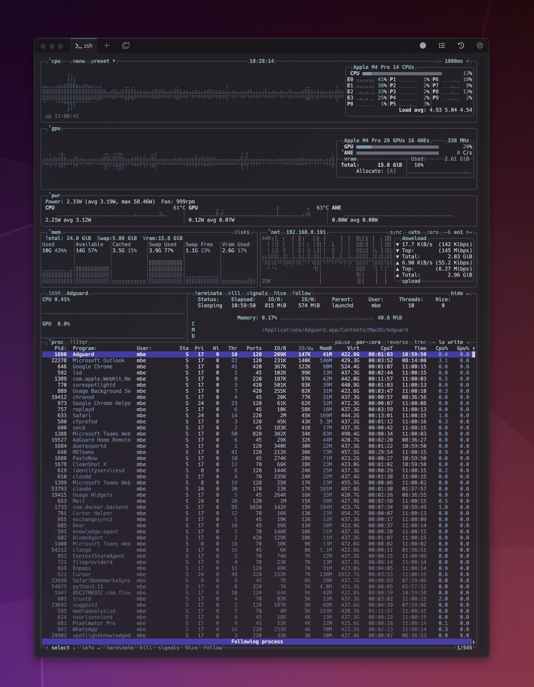
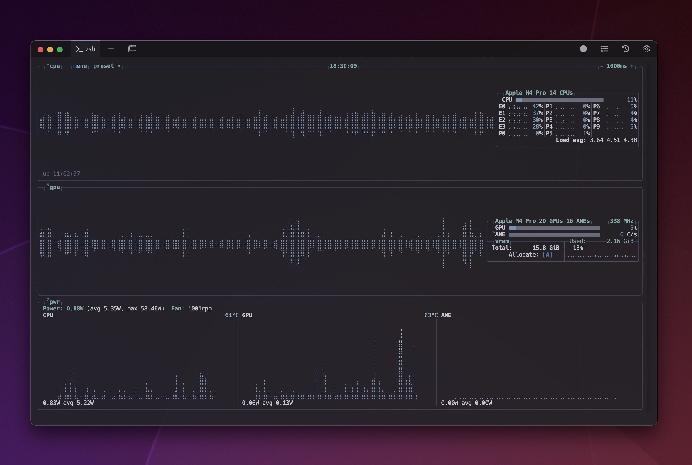
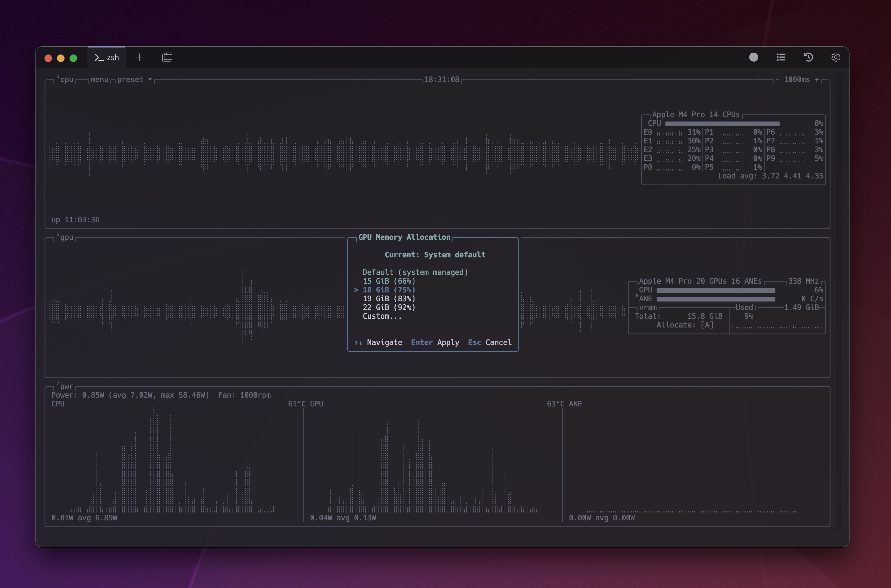
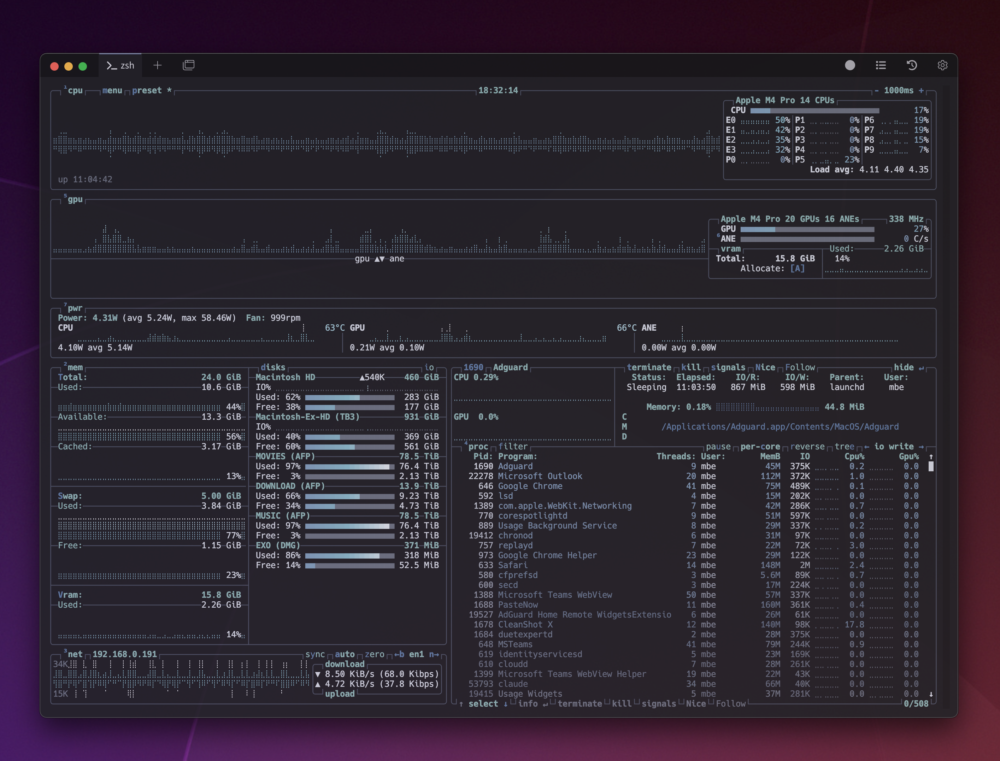

<p align="center">
  
</p>

<h3 align="center">The Apple Silicon System Monitor</h3>

<p align="center">
  <b>mbtop</b> — A powerful terminal-based system monitor optimized for Apple Silicon Macs
</p>

<p align="center">
  <a href="#features">Features</a> •
  <a href="#installation">Installation</a> •
  <a href="#screenshots">Screenshots</a> •
  <a href="#configuration">Configuration</a> •
  <a href="#themes">Themes</a> •
  <a href="#license">License</a>
</p>

---

## Features

**mbtop** brings comprehensive Apple Silicon monitoring to your terminal:

### Apple Silicon Exclusive
- **GPU Monitoring** — Real-time GPU utilization, frequency, and temperature
- **Power Monitoring** — CPU, GPU, and ANE power draw in watts
- **Apple Neural Engine (ANE)** — Monitor ANE utilization with dedicated graphs
- **VRAM Allocation** — GPU memory usage with clickable allocation dialog
- **Unified Memory** — Full memory bandwidth and pressure monitoring
- **Per-Process GPU** — Track GPU usage per process with optional graphs

### Core Features
- **CPU Monitoring** — Per-core usage, frequency, and temperature
- **Memory** — Used, available, cached, with visual graphs and disk meters
- **Disk I/O** — Read/write speeds and usage per disk with separate colors
- **Network** — Upload/download speeds with interface filtering
- **Process List** — Sortable, filterable, with tree view and GPU column
- **Responsive UI** — Adapts gracefully to terminal size

### User Experience
- **Redesigned Settings Menu** — Full mouse support with tabbed interface (v1.6+)
- **Preset Builder** — 100+ layout configurations with live preview
- **Multi-Instance Support** — Run multiple instances without config conflicts (v1.6.1+)
- **Instance Indicators** — Visual (P)rimary/(S)econdary markers in panel headers (v1.6.3+)
- **Themes** — 20+ built-in themes including new Nord-based default
- **Mouse Support** — Full mouse interaction throughout all menus
- **Vim Keys** — Navigate with h/j/k/l
- **Flexible Layouts** — Position CPU/GPU/PWR panels at top or bottom

---

## Screenshots

<p align="center">
  
</p>

<p align="center">
  
</p>

<p align="center">
  
</p>

<p align="center">
  
</p>

<p align="center">
  
</p>

---

## Installation

### macOS (Apple Silicon)

#### Homebrew (Coming Soon)
```bash
brew install mbtop
```

#### Manual Installation
```bash
# Clone the repository
git clone https://github.com/marcoxyz123/mbtop.git
cd mbtop

# Build
make

# Install (optional)
sudo make install
```

### Linux

#### From Source
```bash
git clone https://github.com/marcoxyz123/mbtop.git
cd mbtop
make
sudo make install
```

> **Note:** Apple Silicon specific features (GPU, Power, ANE) are only available on macOS.

---

## Requirements

### macOS
- macOS 12.0 (Monterey) or later
- Apple Silicon (M1/M2/M3/M4) recommended
- Xcode Command Line Tools

### Linux
- GCC 10+ or Clang 16+
- GNU Make
- C++23 support

---

## Configuration

Configuration file location: `~/.config/mbtop/mbtop.conf`

### Key Options

```ini
# Color theme (20+ built-in themes)
color_theme = "Default"

# Update time in milliseconds
update_ms = 2000

# Show GPU info (macOS only)
show_gpu_info = true

# Show power stats (Apple Silicon only)
show_power_stats = true

# Process sorting
proc_sorting = "cpu lazy"

# Per-process GPU tracking
proc_gpu = true

# Multi-instance protection
prevent_autosave = false
```

### Keyboard Shortcuts

| Key | Action |
|-----|--------|
| `h` `j` `k` `l` | Vim-style navigation |
| `↑` `↓` `←` `→` | Arrow navigation |
| `Enter` | Expand/collapse in tree view |
| `m` | Open settings menu |
| `t` | Toggle tree view |
| `r` | Reverse sort order |
| `f` | Filter processes |
| `c` | Toggle per-core CPU |
| `g` | Toggle GPU info |
| `p` | Toggle power stats |
| `6` | Split GPU/ANE graphs |
| `V` | Toggle VRAM display |
| `e` | Edit preset (in Presets tab) |
| `q` `Esc` | Quit |
| `?` `F1` | Help menu |

---

## Themes

mbtop includes several built-in themes:

- **Default** — Balanced colors for most terminals
- **TTY** — High contrast for TTY/console
- **Dracula** — Popular dark theme
- **Nord** — Arctic, bluish theme
- **Gruvbox** — Retro groove colors
- **OneDark** — Atom One Dark inspired

Custom themes can be placed in `~/.config/mbtop/themes/`

---

## What's New in v1.6

### v1.6.3

- **Instance Indicators** — (P)rimary/(S)econdary markers in panel headers
- **Improved Multi-Instance** — Visual feedback for read-only instances

### v1.6.2

- **Mouse-Clickable VRAM Dialog** — Click to select allocation options
- **Save/Cancel Buttons** — Dialog buttons for VRAM allocation

### v1.6.1

- **Multi-Instance Support** — Prevent AutoSave setting protects primary config
- **Read-Only Mode** — Secondary instances won't overwrite settings

### v1.6.0

- **Redesigned Settings Menu** — Full mouse support with tabbed interface
- **Preset Builder** — 100+ layout configurations with live preview
- **GPU/PWR Position Controls** — Place panels at top or bottom
- **Network Interface Filter** — Cycle through specific interfaces
- **New Default Theme** — Nord-based color scheme

---

## Comparison with Other Tools

### System Monitoring

| Feature | mbtop | htop | btop | mactop |
|---------|-------|------|------|--------|
| Apple Silicon GPU | ✅ | ❌ | ❌ | ✅ |
| GPU Power (Watts) | ✅ | ❌ | ❌ | ❌ |
| CPU Power (Watts) | ✅ | ❌ | ❌ | ❌ |
| ANE Monitoring | ✅ | ❌ | ❌ | ❌ |
| VRAM Allocation Dialog | ✅ | ❌ | ❌ | ❌ |
| Per-Process GPU | ✅ | ❌ | ❌ | ❌ |
| Per-Core CPU | ✅ | ✅ | ✅ | ✅ |
| CPU Temperature | ✅ | ❌ | ✅ | ✅ |
| Memory Details | ✅ | ✅ | ✅ | Basic |
| Swap Usage | ✅ | ✅ | ✅ | ❌ |
| Network I/O | ✅ | ❌ | ✅ | ❌ |
| Disk I/O | ✅ | ❌ | ✅ | ❌ |

### Process Management

| Feature | mbtop | htop | btop | mactop |
|---------|-------|------|------|--------|
| Full Process List | ✅ | ✅ | ✅ | Limited |
| Process Tree View | ✅ | ✅ | ✅ | ❌ |
| Process I/O Stats | ✅ | ✅ | ✅ | ❌ |
| Process Memory Details | ✅ | ✅ | ✅ | Basic |
| Process Filtering | ✅ | ✅ | ✅ | ❌ |
| Process Kill/Signal | ✅ | ✅ | ✅ | ❌ |
| Process Nice/Priority | ✅ | ✅ | ✅ | ❌ |
| Per-Process GPU | ✅ | ❌ | ❌ | ❌ |
| Custom Sort Fields | ✅ | ✅ | ✅ | ❌ |
| Process User Filter | ✅ | ✅ | ✅ | ❌ |

### User Interface

| Feature | mbtop | htop | btop | mactop |
|---------|-------|------|------|--------|
| Themes (20+) | ✅ | ❌ | ✅ | ❌ |
| Custom Themes | ✅ | ❌ | ✅ | ❌ |
| Full Mouse Support | ✅ | Partial | ✅ | ❌ |
| Vim Keybindings | ✅ | ❌ | ✅ | ❌ |
| Preset Builder | ✅ | ❌ | ❌ | ❌ |
| Multi-Instance Support | ✅ | ❌ | ❌ | ❌ |
| Responsive Layout | ✅ | ✅ | ✅ | ❌ |
| Unicode Graphs | ✅ | ❌ | ✅ | ❌ |

### Platform Support

| Feature | mbtop | htop | btop | mactop |
|---------|-------|------|------|--------|
| macOS (Apple Silicon) | ✅ | ✅ | ✅ | ✅ |
| macOS (Intel) | ✅ | ✅ | ✅ | ❌ |
| Linux | ✅ | ✅ | ✅ | ❌ |
| FreeBSD | ✅ | ✅ | ✅ | ❌ |
| NetBSD/OpenBSD | ✅ | ✅ | ✅ | ❌ |

---

## Building from Source

### Dependencies

**macOS:**
```bash
xcode-select --install
```

**Linux (Debian/Ubuntu):**
```bash
sudo apt install build-essential gcc-12 g++-12
```

**Linux (Fedora):**
```bash
sudo dnf install gcc-c++ make
```

### Build Options

```bash
# Standard build
make

# Debug build
make DEBUG=true

# Verbose build
make VERBOSE=true

# Clean build
make clean && make
```

---

## Credits

mbtop is a fork of [btop++](https://github.com/aristocratos/btop) by aristocratos, enhanced with comprehensive Apple Silicon support.

**Author:** Marco Berger

---

## License

[Apache License 2.0](LICENSE)

```
Copyright 2024-2026 Marco Berger
Copyright 2021 aristocratos

Licensed under the Apache License, Version 2.0
```
