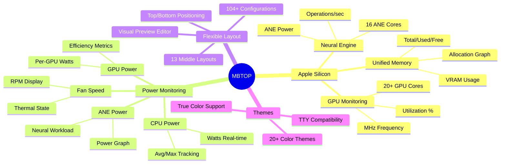

# MBTOP Wiki

  

**MBTOP** (Mac BTOP) is the most advanced terminal-based system monitor for Apple Silicon Macs, featuring comprehensive GPU, Neural Engine, and power monitoring.

---

## Screenshots

  

---

## Features

---

## Documentation

### Getting Started
| Page | Description |
|------|-------------|
| **[Installation](Installation.md)** | Build and install instructions |
| **[Quick Start](Quick-Start.md)** | First-time user guide |
| **[Keyboard Shortcuts](Keyboard-Shortcuts.md)** | All hotkeys reference |

### Configuration
| Page | Description |
|------|-------------|
| **[Settings Menu](Settings-Menu.md)** | Complete settings reference |
| **[Preset Builder](Preset-Builder.md)** | Layout customization guide |
| **[Themes](Themes.md)** | Theme selection and customization |

### Panels
| Page | Description |
|------|-------------|
| **[CPU Panel](Panel-CPU.md)** | CPU monitoring features |
| **[GPU Panel](Panel-GPU.md)** | Apple Silicon GPU monitoring |
| **[PWR Panel](Panel-PWR.md)** | Power consumption tracking |
| **[MEM Panel](Panel-MEM.md)** | Memory and disk usage |
| **[NET Panel](Panel-NET.md)** | Network monitoring |
| **[PROC Panel](Panel-PROC.md)** | Process management |

### Apple Silicon
| Page | Description |
|------|-------------|
| **[Apple Silicon Features](Apple-Silicon.md)** | M1/M2/M3/M4 specific features |
| **[GPU Monitoring](GPU-Monitoring.md)** | Detailed GPU metrics |
| **[Neural Engine](Neural-Engine.md)** | ANE monitoring |
| **[Power Management](Power-Management.md)** | Power efficiency tracking |

---

## System Architecture

```mermaid
flowchart TB
    subgraph Hardware["Apple Silicon Hardware"]
        CPU["CPU Cores<br>P-Cores + E-Cores"]
        GPU["GPU Cores<br>Up to 40 cores"]
        ANE["Neural Engine<br>Up to 16 cores"]
        UMA["Unified Memory<br>Up to 192GB"]
    end

    subgraph Collection["Data Collection"]
        IOKit["IOKit Framework"]
        SMC["SMC Interface"]
        Sysctl["sysctl API"]
        Mach["Mach APIs"]
    end

    subgraph Processing["MBTOP Processing"]
        Collect["Collector Threads"]
        Process["Data Processing"]
        Render["Renderer"]
    end

    subgraph Display["Terminal Display"]
        CPU_Panel["CPU Panel"]
        GPU_Panel["GPU Panel"]
        PWR_Panel["PWR Panel"]
        MEM_Panel["MEM Panel"]
        NET_Panel["NET Panel"]
        PROC_Panel["PROC Panel"]
    end

    CPU --> IOKit
    GPU --> IOKit
    ANE --> IOKit
    UMA --> Sysctl

    IOKit --> Collect
    SMC --> Collect
    Sysctl --> Collect
    Mach --> Collect

    Collect --> Process
    Process --> Render

    Render --> CPU_Panel
    Render --> GPU_Panel
    Render --> PWR_Panel
    Render --> MEM_Panel
    Render --> NET_Panel
    Render --> PROC_Panel

    style Hardware fill:#1a1a2e
    style Collection fill:#16213e
    style Processing fill:#0f3460
    style Display fill:#e94560
```

---

## Quick Reference

### Main Interface Keys
| Key | Action |
|-----|--------|
| `m` | Open Menu |
| `Esc` | Close/Back |
| `q` | Quit |
| `h` | Help |
| `p` | Cycle Presets |
| `1-4` | Quick Preset |
| `+`/`-` | Adjust Update Rate |

### Panel Toggles
| Key | Panel |
|-----|-------|
| `c` | CPU |
| `g` | GPU |
| `w` | PWR (Power) |
| `d` | MEM/Disks |
| `n` | NET |
| `r` | PROC |

---

## Requirements

| Requirement | Minimum | Recommended |
|-------------|---------|-------------|
| **macOS** | 12.0 (Monterey) | 14.0+ (Sonoma) |
| **Hardware** | Apple Silicon M1 | M2/M3/M4 |
| **Terminal** | 80×24 | 200×60+ |
| **Font** | Any Monospace | Nerd Font |

---

## Comparison

| Feature | MBTOP | btop++ | htop | Activity Monitor |
|---------|-------|--------|------|------------------|
| Apple Silicon GPU | ✅ Full | ❌ | ❌ | ✅ GUI Only |
| Neural Engine | ✅ | ❌ | ❌ | ❌ |
| Per-Component Power | ✅ | ❌ | ❌ | ✅ Limited |
| VRAM Monitoring | ✅ | ❌ | ❌ | ✅ |
| Terminal UI | ✅ | ✅ | ✅ | ❌ |
| Preset System | ✅ 104+ | ✅ 4 | ❌ | ❌ |
| Fan Speed | ✅ | ❌ | ❌ | ❌ |

---

## Contributing

See **[Contributing Guide](Contributing.md)** for:
- Code style guidelines
- Pull request process
- Issue reporting
- Feature requests

---

## License

MBTOP is licensed under the Apache License 2.0.

Based on [btop++](https://github.com/aristocratos/btop) by aristocratos.
