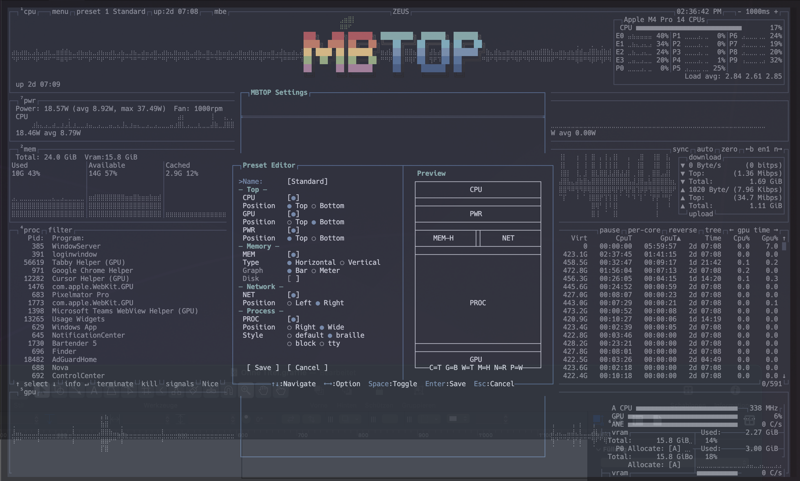
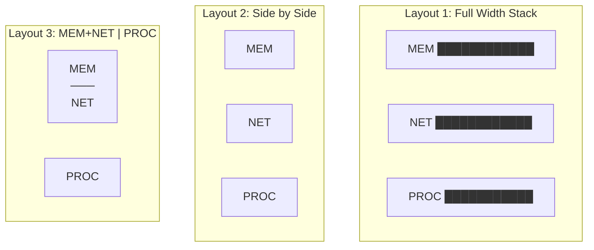
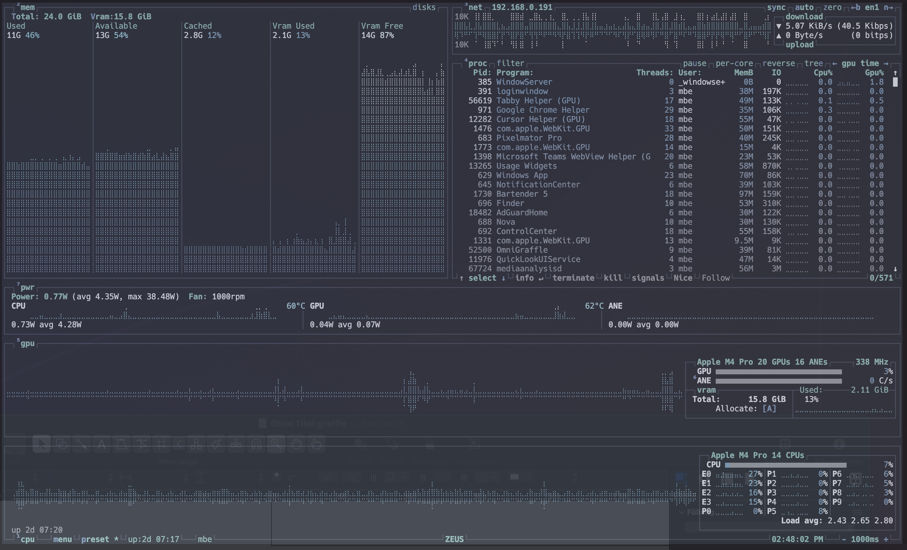
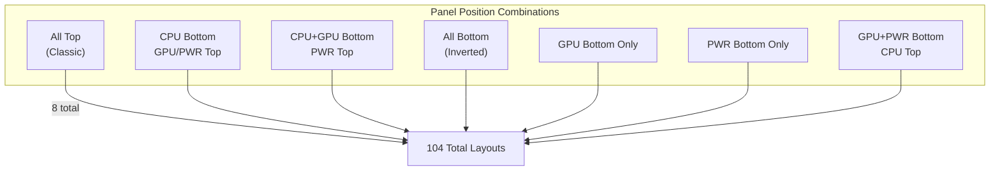
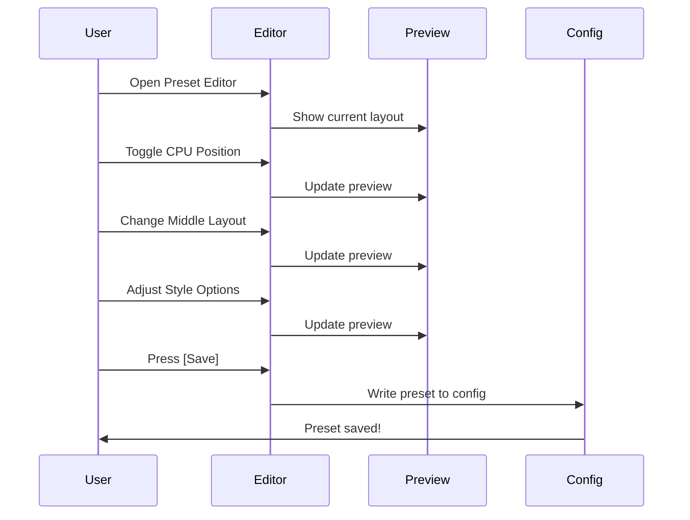

# MBTOP Preset Builder

The Preset Builder is a powerful visual layout editor that allows you to create custom panel arrangements with real-time preview. Access it from **Settings → Presets → [Edit]** or press `e` on any preset.



---

## Overview

The Preset Builder provides:
- **13 middle panel layouts** for MEM, NET, and PROC panels
- **Independent top/bottom positioning** for CPU, GPU, and PWR panels
- **Real-time visual preview** of your layout
- **Per-panel customization** options

### Total Configurations

```
Middle Layouts:     13 combinations
× CPU Position:     2 (Top/Bottom)
× GPU Position:     2 (Top/Bottom)
× PWR Position:     2 (Top/Bottom)
─────────────────────────────────
= 104 base layouts + visibility toggles
```

---

## Preset Editor Interface

```mermaid
graph TB
    subgraph Editor["Preset Editor"]
        subgraph Left["Configuration Panel"]
            Name["Preset Name"]
            Top["Top Panels: CPU, GPU, PWR"]
            Middle["Middle Panels: MEM, NET, PROC"]
            Style["Style Options"]
        end

        subgraph Right["Preview Panel"]
            Preview["Real-time Layout Preview"]
            CPU_P["CPU Box"]
            GPU_P["GPU Box"]
            PWR_P["PWR Box"]
            MEM_P["MEM Box"]
            NET_P["NET Box"]
            PROC_P["PROC Box"]
        end
    end

    Left --> Right

    style Editor fill:#1a1a2e
    style Preview fill:#16213e
```



---

## Configuration Options

### Top Panel Section

| Option | Values | Description |
|--------|--------|-------------|
| **CPU** | On/Off | Enable CPU panel |
| **CPU Position** | Top/Bottom | CPU panel placement |
| **GPU** | On/Off | Enable GPU panel (Apple Silicon) |
| **GPU Position** | Top/Bottom | GPU panel placement |
| **PWR** | On/Off | Enable Power panel |
| **PWR Position** | Top/Bottom | Power panel placement |

### Middle Panel Section

| Option | Values | Description |
|--------|--------|-------------|
| **MEM** | On/Off | Enable Memory panel |
| **Type** | Horizontal/Vertical | MEM panel orientation |
| **Bar/Meter** | Bar/Meter | MEM visualization style |
| **NET** | On/Off | Enable Network panel |
| **PROC** | On/Off | Enable Process panel |

### Style Options

| Option | Values | Description |
|--------|--------|-------------|
| **Proc Position** | Left/Right | Process panel position |
| **Proc Size** | Wide/Normal | Process panel width |
| **Style** | Block/TTY | Rendering style |

---

## 13 Middle Panel Layouts

The middle panel layouts control how MEM, NET, and PROC are arranged:



### Layout Matrix

| # | MEM | NET | PROC | Description |
|---|-----|-----|------|-------------|
| 1 | Full | Full | Full | All panels stacked vertically |
| 2 | Left | Center | Right | Three columns |
| 3 | Top-Left | Bottom-Left | Right | MEM/NET stacked, PROC right |
| 4 | Left | Top-Right | Bottom-Right | MEM left, NET/PROC stacked |
| 5 | Full | Left | Right | MEM top, NET/PROC split |
| 6 | Left | Right | Hidden | MEM and NET only |
| 7 | Full | Hidden | Full | MEM and PROC only |
| 8 | Hidden | Full | Full | NET and PROC only |
| 9 | Full | Hidden | Hidden | MEM only (maximized) |
| 10 | Hidden | Full | Hidden | NET only (maximized) |
| 11 | Hidden | Hidden | Full | PROC only (maximized) |
| 12 | Top | Top | Bottom | Split horizontal |
| 13 | Wide | Narrow | Wide | Custom proportions |

---

## Top/Bottom Panel Positioning

### CPU at Bottom



When CPU is positioned at bottom:
- CPU panel anchors to screen bottom
- Middle panels (MEM, NET, PROC) fill remaining space
- GPU/PWR stack above CPU if also at bottom

### Stacking Order (Bottom)

```mermaid
graph BT
    subgraph Screen["Terminal Screen"]
        TOP["Middle Panels<br>(MEM, NET, PROC)"]
        PWR_B["PWR Panel"]
        GPU_B["GPU Panel"]
        CPU_B["CPU Panel"]
    end

    CPU_B --> GPU_B
    GPU_B --> PWR_B
    PWR_B --> TOP

    style CPU_B fill:#e94560
    style GPU_B fill:#0f3460
    style PWR_B fill:#16c79a
```



**Bottom panel order (from screen bottom up):**
1. **CPU** - Always at very bottom if enabled
2. **GPU** - Above CPU
3. **PWR** - Above GPU

### Position Combinations



---

## Visual Preview System

The preview panel shows your layout in real-time:

```
┌──────────────────────────────────────┐
│              Preview                  │
├──────────────────────────────────────┤
│  ┌────────────┐  ┌────────────┐      │
│  │    CPU     │  │    PWR     │      │
│  └────────────┘  └────────────┘      │
│                                       │
│  ┌────────┐  ┌───────────────┐       │
│  │  MEM-H │  │      NET      │       │
│  └────────┘  └───────────────┘       │
│                                       │
│  ┌───────────────────────────┐       │
│  │          PROC             │       │
│  └───────────────────────────┘       │
│                                       │
│  ┌───────────────────────────┐       │
│  │          GPU              │       │
│  └───────────────────────────┘       │
└──────────────────────────────────────┘
```

### Preview Features
- **Box outlines** show panel boundaries
- **Labels** indicate panel type
- **Position indicators** show top/bottom placement
- **Relative sizing** reflects actual proportions

---

## Creating a Custom Preset

### Step-by-Step Flow



### Keyboard Controls

| Key | Action |
|-----|--------|
| `↑` / `↓` | Navigate options |
| `←` / `→` | Change values |
| `Space` | Toggle On/Off |
| `Enter` | Save preset |
| `Esc` | Cancel changes |
| `Ctrl+T` | Test layout |
| `Ctrl+D` | Delete preset |
| `Ctrl+N` | New preset |

---

## Built-in Presets

### 1. Standard
```
CPU: Top | GPU: Top | PWR: Top
MEM: Left | NET: Right-Top | PROC: Right-Bottom
```
Classic btop++ layout with all panels visible.

### 2. Lite
```
CPU: Top | GPU: Off | PWR: Off
MEM: Left | NET: Off | PROC: Right
```
Minimal layout for low resource usage.

### 3. Processes
```
CPU: Top | GPU: Off | PWR: Off
MEM: Off | NET: Off | PROC: Maximized
```
Focus on process management.

### 4. Power
```
CPU: Bottom | GPU: Bottom | PWR: Bottom
MEM: Top-Left | NET: Top-Right | PROC: Middle
```
Power monitoring emphasis with bottom panel stack.

---

## Configuration Storage

Presets are stored in `~/.config/btop/btop.conf`:

```ini
# Preset format: name,cpu:pos:symbol,gpu0:pos:symbol,pwr:pos:symbol,mem,net,proc
presets = "Standard,cpu:0:1,gpu0:0:1,pwr:0:1,mem,net,proc"
presets = "Power,cpu:1:1,gpu0:1:1,pwr:1:1,mem,net,proc"
```

### Preset String Format

```
name,cpu:position:enabled,gpu0:position:enabled,pwr:position:enabled,mem,net,proc
```

| Field | Values | Description |
|-------|--------|-------------|
| `position` | 0=Top, 1=Bottom | Panel position |
| `enabled` | 0=Off, 1=On | Panel visibility |
| `mem/net/proc` | present/absent | Middle panel enabled |

---

## Example Configurations

### Server Monitoring
```
CPU: Top (temperature focus)
GPU: Hidden
PWR: Hidden
MEM: Full width (disk focus)
NET: Full width
PROC: Maximized (process management)
```

### ML Development
```
CPU: Bottom
GPU: Bottom (large, GPU metrics focus)
PWR: Bottom (power efficiency)
MEM: Top-Left (VRAM monitoring)
NET: Hidden
PROC: Top-Right
```

### Desktop Usage
```
CPU: Top (compact)
GPU: Top (minimal)
PWR: Top
MEM: Left
NET: Right-Top
PROC: Right-Bottom
```

---

## Tips & Best Practices

1. **Start with a built-in preset** and modify from there
2. **Use the preview** to verify layout before saving
3. **Consider your terminal size** - some layouts need more space
4. **Test with `Ctrl+T`** before committing changes
5. **Name presets descriptively** for easy switching

---

## See Also
- **[Settings Menu](Settings-Menu.md)** - Full settings documentation
- **[Panel Reference](Panels.md)** - Individual panel details
- **[Apple Silicon Features](Apple-Silicon.md)** - GPU/ANE/PWR specifics
