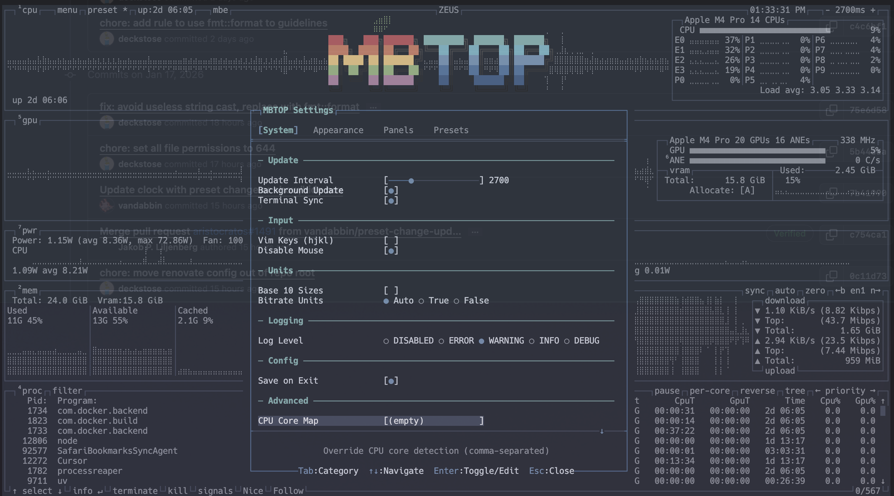
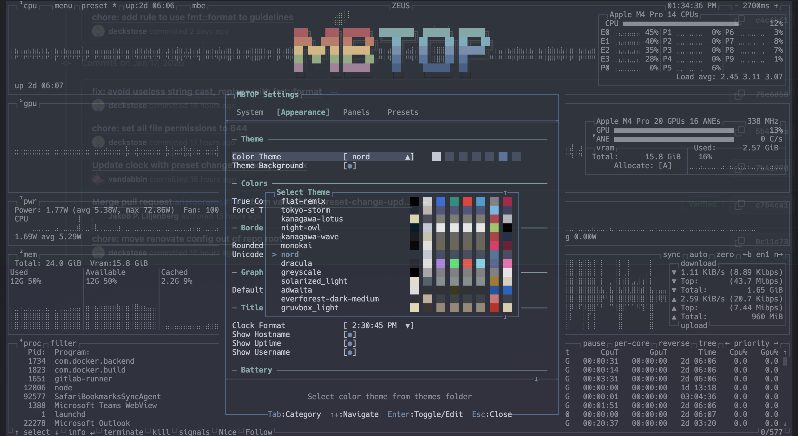
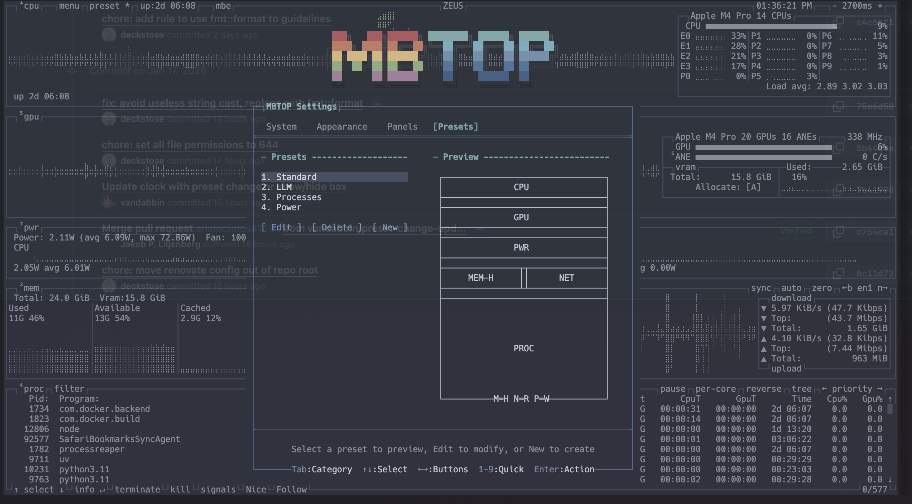
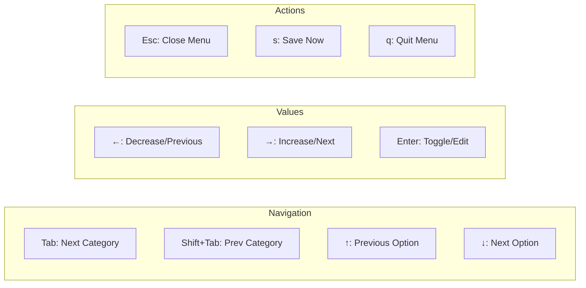

# MBTOP Settings Menu

The MBTOP Settings Menu provides comprehensive control over every aspect of the system monitor. Access it by pressing `m` (menu) from the main interface.

## Navigation

| Key | Action |
|-----|--------|
| `Tab` / `Shift+Tab` | Navigate between categories |
| `↑` / `↓` | Navigate options within category |
| `←` / `→` | Change option values |
| `Enter` | Toggle/Edit/Select |
| `Esc` | Close menu |

---

## Menu Structure

```mermaid
graph TB
    subgraph Settings["MBTOP Settings"]
        System["System"]
        Appearance["Appearance"]
        Panels["Panels"]
        Presets["Presets"]
    end

    System --> Update["Update Settings"]
    System --> Input["Input Settings"]
    System --> Logging["Logging"]
    System --> Config["Config"]
    System --> Advanced["Advanced"]

    Appearance --> Theme["Theme"]
    Appearance --> Colors["Colors"]
    Appearance --> Title["Title Bar"]
    Appearance --> Battery["Battery"]

    Panels --> CPU["CPU | Display"]
    Panels --> CPUTemp["CPU | Temperature"]
    Panels --> CPUGraph["CPU | Graphs"]
    Panels --> GPUInfo["CPU | GPU Info"]
    Panels --> GPU["GPU | Display"]
    Panels --> MEM["MEM | Disks"]
    Panels --> NET["NET"]
    Panels --> PROC["PROC"]
    Panels --> PWR["PWR"]

    Presets --> PresetList["Preset Selection"]
    Presets --> PresetEditor["Preset Editor"]

    style Settings fill:#1a1a2e,stroke:#16213e
    style Presets fill:#0f3460,stroke:#e94560
```

---

## Tab 1: System

### Update Settings
| Option | Values | Description |
|--------|--------|-------------|
| **Update Interval** | 100-10000ms | How often to refresh data (default: 2000ms) |
| **Background Update** | On/Off | Update when window not focused |
| **Terminal Sync** | On/Off | Sync with terminal refresh rate |

### Input Settings
| Option | Values | Description |
|--------|--------|-------------|
| **Vim Keys** | On/Off | Enable hjkl navigation |
| **Disable Mouse** | On/Off | Disable mouse interaction |

### Logging
| Option | Values | Description |
|--------|--------|-------------|
| **Base 10 Sizes** | On/Off | Use 1000 instead of 1024 for sizes |
| **Bitrate Units** | Auto/True/False | Show network in bits vs bytes |
| **Log Level** | DISABLED/ERROR/WARNING/INFO/DEBUG | Logging verbosity |

### Config
| Option | Values | Description |
|--------|--------|-------------|
| **Save on Exit** | On/Off | Auto-save settings on exit |

### Advanced
| Option | Values | Description |
|--------|--------|-------------|
| **CPU Core Map** | (empty) | Override CPU core detection (comma-separated) |

---

## Tab 2: Appearance

### Theme Selection
- **Color Theme**: Choose from 20+ built-in themes
- **Theme Background**: Enable/disable theme background color
- **Live Preview**: Color palette shown in real-time

### Available Themes
| Category | Themes |
|----------|--------|
| **Dark** | Default, tokyo-storm, night-owl, dracula, gruvbox_dark, nord |
| **Light** | gruvbox_light, solarized_light |
| **Colorful** | flat-remix, rainbow-wave, monokai, HotPurpleTrafficLight |
| **Minimal** | greyscale, TTY |

### Colors Section
- **True Color**: Enable 24-bit color support
- **Force TTY**: Force TTY-compatible rendering
- **Unicode**: Enable Unicode characters
- **Borders**: Border style (Line, Block, None)
- **Graph Symbol**: Default/Braille/Block/TTY

### Title Bar
| Option | Values | Description |
|--------|--------|-------------|
| **Clock Format** | 12h/24h formats | Status bar clock format |
| **Show Uptime** | On/Off | Display system uptime |
| **Show Username** | On/Off | Display current user |

---

## Tab 3: Panels

### CPU | Display
| Option | Values | Description |
|--------|--------|-------------|
| **CPU at Bottom** | On/Off | Position CPU panel at screen bottom |
| **Show Uptime** | On/Off | Show uptime in CPU panel |
| **Show Frequency** | On/Off | Display CPU frequency |
| **Show Power** | On/Off | Show CPU power consumption |
| **Custom CPU Name** | Text | Override detected CPU name |

### CPU | Temperature
| Option | Values | Description |
|--------|--------|-------------|
| **Show Temperature** | On/Off | Enable temperature display |
| **Show Core Temps** | On/Off | Per-core temperature |
| **Temperature Scale** | Celsius/Fahrenheit/Kelvin/Rankine | Temperature unit |
| **Temperature Sensor** | Auto/List | Select temperature source |

### CPU | Graphs
| Option | Values | Description |
|--------|--------|-------------|
| **Graph Symbol** | Default/Braille/Block/TTY | Graph rendering style |
| **Upper Graph** | Auto/Total/User/System | Top graph data source |
| **Lower Graph** | Auto/Total/User/System | Bottom graph data source |
| **Single Graph** | On/Off | Combine into single graph |
| **Invert Lower** | On/Off | Flip lower graph direction |

### CPU | GPU Info
| Option | Values | Description |
|--------|--------|-------------|
| **Show GPU Info** | Auto/On/Off | Inline GPU info in CPU panel |

### GPU | Display (Apple Silicon)
| Option | Values | Description |
|--------|--------|-------------|
| **GPU at Bottom** | On/Off | Position GPU panel at bottom |
| **Show GPU Panels** | Selection | Which GPU panels to display |

### PWR (Power Panel)
| Option | Values | Description |
|--------|--------|-------------|
| **PWR at Bottom** | On/Off | Position power panel at bottom |
| **Show CPU Power** | On/Off | CPU power graph |
| **Show GPU Power** | On/Off | GPU power graph |
| **Show ANE Power** | On/Off | Neural Engine power graph |

---

## Tab 4: Presets

### Quick Selection
Select from pre-configured layouts:
1. **Standard** - All panels, classic layout
2. **Lite** - Minimal resource usage
3. **Processes** - Focus on process list
4. **Power** - Power monitoring emphasis

### Visual Preview
- Real-time layout preview before applying
- Shows panel arrangement and sizes
- Preview updates as you navigate presets

### Preset Editor
Press `e` on any preset to open the full **[Preset Builder](Preset-Builder.md)**

---

## Settings Flow

```mermaid
flowchart LR
    A[Press 'm'] --> B{Settings Menu}
    B --> C[Navigate Tabs]
    C --> D[Change Options]
    D --> E{Save?}
    E -->|Yes| F[Save on Exit]
    E -->|No| G[Discard]
    F --> H[Apply Changes]
    G --> H
    H --> I[Return to Monitor]

    style B fill:#0f3460
    style F fill:#16c79a
    style G fill:#e94560
```

---

## Keyboard Reference

---

## See Also
- **[Preset Builder](Preset-Builder.md)** - Advanced layout customization
- **[Keyboard Shortcuts](Keyboard-Shortcuts.md)** - Full key reference
- **[Themes](Themes.md)** - Theme customization guide
